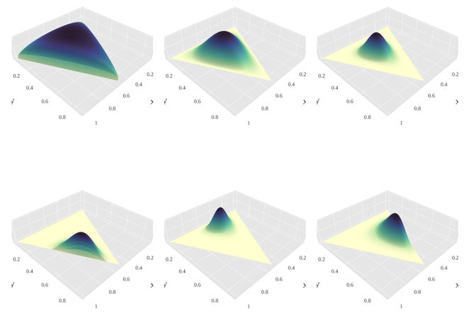

```{r setup, include=FALSE}
options(width = 100)
knitr::opts_chunk$set(cache = TRUE)

# define a hook to allow font size changes in beamer:
# from https://stackoverflow.com/questions/26372138/beamer-presentation-rstudio-change-font-size-for-chunk
knitr::knit_hooks$set(mysize = function(before, options, envir) {
  if (before) 
    return(options$size)
})

library(tidyverse)
library(patchwork)
library(brms)
theme_set(theme_bw())
```

## Linear Regression

Assume that the predictor term $\eta$ is a linear combination of the predictor variables multiplied by the regression coefficents:

$$\eta = b_0 + \sum_{k=1}^K b_k x_{k}$$

Predictors $x_k$ may be

- continuous variables
- coded categorical variables

\bigskip

\centering
**What about ordinal predictors?**


## Monotonic Effects: Idea

```{r, echo=FALSE, fig.width=6, fig.height=4.2}
dat <- data.frame(x = 0:3, y = c(0, 60, 90, 100))
arrow_dat <- data.frame(
  x = c(0, 0, 1, 1, 2, 2),
  y = c(2, 98, 2, 58, 62, 88),
  group = c(1, 1, 2, 2, 3, 3)
)
ggplot(dat, aes(x, y)) + 
  geom_line(size = 1.5) +
  scale_y_continuous(breaks = seq(0, 100, 10))
```


## Monotonic Effects: Idea

```{r, echo=FALSE, fig.width=6, fig.height=4.2}
dat <- data.frame(x = 0:3, y = c(0, 60, 90, 100))
arrow_dat <- data.frame(
  x = c(0, 0, 1, 1, 2, 2),
  y = c(2, 98, 2, 58, 62, 88),
  group = c(1, 1, 2, 2, 3, 3)
)
ggplot(dat, aes(x, y)) + 
  geom_line(size = 1.5) +
  geom_line(
    aes(group = group),
    data = arrow_dat,
    arrow = arrow(length = unit(0.30, "cm"), ends = "both", type = "closed")
  ) +
  scale_y_continuous(breaks = seq(0, 100, 10)) +
  annotate(
    'text', x = 0.2, y = 55, 
    label = "b~D",
    parse = TRUE, size = 10
  ) +
  annotate(
    'text', x = 1.35, y = 25, 
    label = "b~D~zeta[1]",
    parse = TRUE, size = 10
  ) + 
  annotate(
    'text', x = 2.35, y = 75, 
    label = "b~D~zeta[2]",
    parse = TRUE, size = 10
  )
```


## Monotonic Effects: Mathematical Formulation

Monotonic regression of an ordinal predictor $x \in \{0, ..., D\}$:

$$
\eta = b_0 + b D \sum_{i = 1}^{x} \zeta_i
$$

- Parameter $\zeta$ is a simplex: $\zeta_i \in [0,1]$ and 
$\sum_{i = 1}^D \zeta_i = 1$
- Parameter $b$ may be any real value

\hfill \newline

Define the monotonic transform:
$$
\text{mo}(x, \zeta) =  D \sum_{i = 1}^{x} \zeta_i
$$

<!--
Implications:

- Effect of $x$ is either monotonically increasing or decreasing
- $b$ indicates the direction and scale of the effect
- Categories are equidistant only if $\zeta_i = 1/D$
-->

## Monotonic Effects: Interactions

Ordinary Regression model including the interaction of $z$ and $x$:
$$
\eta = b_0 + b_1 \, z + b_2 \, x +  b_3 \, z \, x
$$

\hfill \newline

Generalize to monotonic effects by replacing $x$ with $\text{mo}(x, \zeta)$:
$$
\eta = b_0 + b_1 \, z + b_2 \, \text{mo}(x, \zeta_{b_2}) +  b_3 \, z \, \text{mo}(x, \zeta_{b_3})
$$

<!--
- Relation of $\zeta_{b_2}$ and $\zeta_{b_3}$ determines the type of monotonicty
- $x$ is (conditionally) monotonic for all $z$ if $\zeta_{b_2} = \zeta_{b_3}$
-->

## Monotonic Effects in a Bayesian Framework

"If you quantify uncertainty with probability you are a Bayesian."

\raggedleft
Michael Betancourt

\hfill \break

\raggedright
Bayes Theorem:
$$
p(\theta \,|\, y) = \frac{p(y \,|\, \theta) \, p(\theta)}{p(y)}
$$

\hfill \break
The monotonic parameters $b$ and $\zeta$ are both part of $\theta$


## Priors for Monotonic Effects in a Bayesian Framework

Priors on $b$:

- Any reasonable prior for regression coefficients
- For instance: $b \sim \mathcal{N}(0, s)$ for a fixed standard deviation $s$

Prior on $\zeta$:

- Dirichlet prior: $\zeta \sim \mathcal{D}(\alpha)$
- $\alpha$: Concentration parameter of the same length as $\zeta$

Let $\alpha_0 = \sum_{i = 1}^{D} \alpha_i$, then:
$$
\mathbb{E}(\zeta_i) = \frac{\alpha_i}{\alpha_0}
$$
$$
\text{SD}(\zeta_i) = \sqrt{\frac{\alpha_i (\alpha_0 - \alpha_i)}{(\alpha_0^2 (\alpha_0 + 1)}}
$$

## Dirichlet Prior: Visualization for $\alpha = (3, 2, 1)$

\centering

```{r, echo=FALSE, fig.width=3.3, fig.height=3.3}
# 
alpha <- c(3, 2, 1)
step <- 0.001
df <- seq(step, 1 - step, step) %>%
  map(~cbind(., seq(step, 1 - ., step))) %>%
  map(as_data_frame) %>%
  bind_rows() %>%
  setNames(c("x1", "x2")) %>%
  mutate(
    x3 = 1 - x1 - x2,
    density = MCMCpack::ddirichlet(cbind(x1, x2, x3), alpha)
  ) %>%
  filter(!is.na(density)) %>%
  identity()

gg_dirichlet <- ggplot(df, aes(x1, x2, fill = density)) +
  geom_raster() +
  scale_fill_viridis_c() +
  guides(fill = FALSE) +
  labs(x = expression(zeta[1]), y = expression(zeta[2])) +
  theme_default()

gg_dirichlet
```


## Dirichlet Prior: Visualization for $\alpha = (3, 2, 1)$

\centering
```{r, include=FALSE}
bprior <- prior(normal(33.3, 5), b) +
  prior(normal(0, 5), Intercept) +
  prior(dirichlet(3, 2, 1), simo, coef = "mox1")
dat_prior <- data.frame(y = rnorm(4), x = 0:3)
fit_prior <- brm(
  y ~ mo(x), data = dat_prior, prior = bprior,
  sample_prior = "only", file = "models/fit_prior"
)
```

```{r, echo=FALSE, fig.height=3.3, fig.width=7}
me_prior <- marginal_effects(fit_prior, probs = c(0.5, 0.5))
me_prior <- plot(me_prior, plot = FALSE)[[1]] +
  theme_default() + ylim(c(-10, 140))
gg_dirichlet + me_prior
```

## Dirichlet Prior: Visualization for $\alpha = (3, 2, 1)$

\centering
```{r, echo=FALSE, fig.height=3.3, fig.width=7}
me_prior <- marginal_effects(fit_prior)
me_prior <- plot(me_prior, plot = FALSE)[[1]] +
  theme_default() + ylim(c(-10, 140))
gg_dirichlet + me_prior
```


## Monotonic effects in the R package brms

<!--
**brms** is a comprehensive framework for Bayesian regression models

**Stan** is used for the model fitting behind the scenes

Monotonic effects are fully built into the formula syntax of brms
-->

\bigskip

Monotonic effect of $x$ on $y$:
```{r, eval = FALSE}
y ~ mo(x)
```

Main effects and interaction of $x$ and $z$:
```{r, eval = FALSE}
y ~ mo(x) * z
```

Varying effect of $x$ over group $g$:
```{r, eval = FALSE}
y ~ mo(x) + (mo(x) | g)
```


## Case Study: Measures of Chronic Widespread Pain (CWP)

Objective: Predict subjective physical health by measures of CWP

\bigskip

Examples for CWP measures:

- Impairments in walking
- Impairments in moving around

Scale from $0$ ('no problem') to $4$ ('complete problem')

Reference: @gertheiss2011CWP

\bigskip

Plausible assumption: CWP measures have **monotonic effects**


## Case Study: Model Specification

```{r, echo=FALSE}
data("ICFCoreSetCWP", package = "ordPens")
cwp <- ICFCoreSetCWP %>% select(-starts_with("e"))
```

```{r, eval=FALSE}
library(brms)
fit1 <- brm(phcs ~ mo(d450) + mo(d455), data = cwp)
```

```{r fit1, include=FALSE}
fit1 <- brm(phcs ~ mo(d450) + mo(d455), data = cwp,
            file = "models/fit4")
```

```{r, echo=FALSE, fig.width=7, fig.height = 4}
pme1 <- plot(marginal_effects(fit1), plot = FALSE, ask = FALSE)
(pme1[[1]] + xlab("d450 (walking)")) +
  (pme1[[2]] + xlab("d455 (moving around)")) +
  plot_layout(ncol = 2)
```


## Parameter Recovery

How well can a model recover its own parameters?

- Simulate data from the model with known parameters
- Fit the model to the simulated data
- Compare estimates to the known parameters

\hfill \newline

Bayesian version: Simulation Based Calibration (SBC) by @talts2018


## Parameter Recovery: Monotonic Main Effects

```{r, include=FALSE}
SBC_ranks <- readRDS("simulations/SBC_ranks.rds") %>%
  mutate(
    index = case_when(
      grepl("^simo_", par) ~ 
        as.numeric(str_extract(par, "(?<=[[:digit:]])[[:digit:]]+$")),
      TRUE ~ NA_real_
    ),
    par = case_when(
      grepl("^simo_", par) ~ 
        paste0(substr(par, 1, nchar(par) - nchar(index)), "[", index, "]"),
      TRUE ~ par
    )
  )
  
B <- 11 
lb = qbinom(0.005, 1000, 1 / B)
ub = qbinom(0.995, 1000, 1 / B)
```

```{r SBC-main-4-200, echo=FALSE, fig.height=4, fig.width=8}
SBC_ranks %>%
  filter(D == 4, nobs == 200, pred == "main") %>%
  ggplot(aes(value)) +
  facet_wrap("par", ncol = 4) +
  geom_histogram(bins = B, color = "black", fill = "lightblue") +
  geom_hline(yintercept = lb, size = 1) + 
  geom_hline(yintercept = ub, size = 1) +
  scale_x_continuous(breaks = seq(0, B - 1, by = 2)) +
  labs(x = "", y = "") +
  theme_bw() +
  theme(
    axis.text.y = element_blank(),
    axis.ticks.y = element_blank()
  )
```

## Parameter Recovery: Monotonic Interactions

```{r SBC-int-4-200, echo=FALSE, fig.height=5, fig.width=8}
SBC_ranks %>%
  filter(D == 4, nobs == 200, pred == "interaction") %>%
  ggplot(aes(value)) +
  facet_wrap("par", ncol = 6) +
  geom_histogram(bins = B, color = "black", fill = "lightblue") +
  geom_hline(yintercept = lb, size = 1) + 
  geom_hline(yintercept = ub, size = 1) +
  scale_x_continuous(breaks = seq(0, B - 1, by = 2)) +
  labs(x = "", y = "") +
  theme_bw() +
  theme(
    axis.text.y = element_blank(),
    axis.ticks.y = element_blank()
  )
```

## Other Approaches for Modelling Ordinal Predictors

- Continuous linear regression
- Categorical linear regression
- Categorical isotonic regression
- Penalized categorical regression
- Monotonic penalized categorical regression
- Regression splines
- ...

## Model Comparison: Monotonic Main Effects

```{r, echo=FALSE}
comp_preds <- readRDS("simulations/comp_preds.rds") %>%
  arrange(D) %>%
  mutate(
    model = str_to_upper(model),
    facet = paste0("D = ", D, " & N = ", nobs),
    facet = factor(facet, levels = unique(facet))
  )
```

```{r rmse-main-mo, echo=FALSE, fig.width=10, fig.height=7}
comp_preds %>%
  filter(effect == "mo", pred == "main") %>%
  # some RMSEs are too large to be reasonably displayed
  filter(model != "LIN") %>%
  filter(!(D == 50 & model == "CAT")) %>%
  ggplot(aes(model, rmse)) +
  geom_boxplot() +
  facet_wrap("facet", scales = "free_y") +
  labs(x = "Model", y = "RMSE")
```

## Model Comparison: Monotonic Interactions

```{r rmse-int-mo, echo=FALSE, fig.width=10, fig.height=7}
comp_preds %>%
  filter(effect == "mo", pred == "interaction") %>%
  filter(!is.na(rmse)) %>%
  # some RMSEs are too large to be reasonably displayed
  filter(model != "LIN") %>%
  filter(!(D == 50 & model == "CAT")) %>%
  ggplot(aes(model, rmse)) +
  geom_boxplot() +
  facet_wrap("facet", scales = "free_y") +
  labs(x = "Model", y = "RMSE")
```

<!--
## Learn More about Monotonic Effects and brms

Preprint: https://psyarxiv.com/9qkhj/ 

Vignette in brms: `vignette("brms_monotonic")`

Documentation of the formula syntax: `?brmsformula`

Papers about brms: @brms1 and @brms2

Forums: http://discourse.mc-stan.org/

Email: paul.buerkner@gmail.com

Twitter: \@paulbuerkner
-->


##

\centering
\LARGE Thank you!


## References

Bürkner, P., & Charpentier, E. (in review). Modeling Monotonic Effects of Ordinal Predictors in Regression Models. https://psyarxiv.com/9qkhj/ 

<div id="refs"></div>

## 

\centering
\LARGE Appendix


## Simulation Based Calibration

How well can a model recover its own parameters?

Steps of Simulation Based Calibration (SBC):

- Sample $\tilde{\theta} \sim p(\theta)$ from the prior
- Sample $\tilde{y} \sim p(y \, | \, \tilde{\theta})$ from the likelihood
- Sample $\{\theta_1, \ldots, \theta_L\} \sim p(\theta | \tilde{y})$ from the posterior
- Compute the rank statistic $r(\{\theta_1, \ldots, \theta_L\} \, | \, \tilde{\theta})$
- Repeat the process multiple times
- Plot the rank statistics in a histogram

For well callibrated models the histogram is (approximately) uniform

Reference: @talts2018


## Parameter Recovery: Interactions with many Predictor Categories (1)

```{r SBC-int-50-50, echo=FALSE, fig.height=5, fig.width=8}
SBC_ranks %>%
  filter(D == 50, nobs == 50, pred == "interaction") %>%
  filter(index %in% c(NA, 1:4)) %>%
  ggplot(aes(value)) +
  facet_wrap("par", ncol = 6) +
  geom_histogram(bins = B, color = "black", fill = "lightblue") +
  geom_hline(yintercept = lb, size = 1) + 
  geom_hline(yintercept = ub, size = 1) +
  scale_x_continuous(breaks = seq(0, B - 1, by = 2)) +
  labs(x = "", y = "") +
  theme_bw() +
  theme(
    axis.text.y = element_blank(),
    axis.ticks.y = element_blank()
  )
```

## Parameter Recovery: Interactions with many Predictor Categories (2)

```{r SBC-int-50-1000, echo=FALSE, fig.height=5, fig.width=8}
SBC_ranks %>%
  filter(D == 50, nobs == 1000, pred == "interaction") %>%
  filter(index %in% c(NA, 1:4)) %>%
  ggplot(aes(value)) +
  facet_wrap("par", ncol = 6) +
  geom_histogram(bins = B, color = "black", fill = "lightblue") +
  geom_hline(yintercept = lb, size = 1) + 
  geom_hline(yintercept = ub, size = 1) +
  scale_x_continuous(breaks = seq(0, B - 1, by = 2)) +
  labs(x = "", y = "") +
  theme_bw() +
  theme(
    axis.text.y = element_blank(),
    axis.ticks.y = element_blank()
  )
```

## Other Approaches for Modelling Ordinal Predictors

Categorical isotonic regression:

- Estimate group means of ordinal categories such that 
$\mu_0 < \mu_1 < ... < \mu_C$
- Equivalent to monotonic effects in simple cases
- Harder to penalize via priors

Penalized regression [@gertheiss2009]:

- Apply dummy coding on the ordinal variable
- Penalize larger differences between adjacent categories via 
$$J(b) =\sum_{i = 1}^D (b_i - b_{i-1})^2$$
- Closely related to regression splines
- No monotonicity constraint


## Model Comparison: Linear Main Effects

```{r rmse-main-lin, echo=FALSE, fig.width=10, fig.height=7}
comp_preds %>%
  filter(effect == "lin", pred == "main") %>%
  ggplot(aes(model, rmse)) +
  geom_boxplot() +
  facet_wrap("facet", scales = "free_y") +
  labs(x = "Model", y = "RMSE")
```

## Model Comparison: Linear Interactions

```{r rmse-int-lin, echo=FALSE, fig.width=10, fig.height=7}
comp_preds %>%
  filter(effect == "lin", pred == "interaction") %>%
  filter(!is.na(rmse)) %>%
  # some RMSEs are too large to be reasonably displayed
  filter(!(D == 50 & model == "CAT")) %>%
  ggplot(aes(model, rmse)) +
  geom_boxplot() +
  facet_wrap("facet", scales = "free_y") +
  labs(x = "Model", y = "RMSE")
```

## Model Comparison: Categorical Main Effects

```{r rmse-main-cat, echo=FALSE, fig.width=10, fig.height=7}
comp_preds %>%
  filter(effect == "cat", pred == "main") %>%
  filter(model != "LIN") %>%
  ggplot(aes(model, rmse)) +
  geom_boxplot() +
  facet_wrap("facet", scales = "free_y") +
  labs(x = "Model", y = "RMSE")
```

## Model Comparison: Categorical Interactions

```{r rmse-int-cat, echo=FALSE, fig.width=10, fig.height=7}
comp_preds %>%
  filter(effect == "cat", pred == "interaction") %>%
  filter(!is.na(rmse)) %>%
  # some RMSEs are too large to be reasonably displayed
  filter(model != "LIN") %>%
  filter(!(D == 50 & model == "CAT")) %>%
  ggplot(aes(model, rmse)) +
  geom_boxplot() +
  facet_wrap("facet", scales = "free_y")
```


## Proof: Monotonicity

Proposition: Monotonic effects are indeed monotonic.

\hfill \newline

Proof idea:
$$
b \text{mo}(x + 1, \zeta) - b \text{mo}(x, \zeta) = 
b D \sum_{i = 1}^{x+1} \zeta_i - b D \sum_{i = 1}^{x} \zeta_i = b D \zeta_{x+1}
$$

Since $D > 0$ and $\zeta_{x+1} > 0$, the linear predictor is
monotonically increasing if $b \geq 0$ and monotonically decreasing if 
$b \leq 0$.

## Proof: Conditional Monotonicity

Proposition: If all $\zeta$ belonging to $x$ are the same, then the predictions
are monotonic in $x$ conditional on all possible values of all other predictors.

\hfill \newline

Proof idea:
$$
\eta(x) = b_0 + \sum_{k=1}^K b_k D_k \sum_{i = 1}^x \zeta_i = b_0 + 
\left( \sum_{k=1}^K b_k D_k \right) \left( \sum_{i = 1}^x \zeta_i \right)
$$

If we define $b = \sum_{i=1}^K b_i D_i$ we see that $\eta(x)$ is
monotonic in $x$ with the sign of the effect determined by the sign of
$b$.

## Counter Example to General Conditional Monotonicity

Model: $\eta = b_0 + b_1 \, z + b_2 \, \text{mo}(x, \zeta_{b_2}) +  b_3 \, z \, \text{mo}(x, \zeta_{b_3})$

```{r, echo=FALSE}
dat <- data.frame(
  x = c(0:2, 0:2), 
  y = c(0, 80, 100, 0, 70, 40),
  z = rep(c("0", "1"), each = 3)
)
dat_diff <- data.frame(
  x = 0:2,
  y = c(0, 10, 60)
)
ggplot(dat, aes(x, y, col = z)) + 
  geom_line(size = 1.5) +
  geom_line(
    aes(x, y), inherit.aes = FALSE, 
    dat = dat_diff, size = 1.5, linetype = 2#
  ) + 
  scale_y_continuous(breaks = seq(0, 100, 10)) +
  scale_x_continuous(breaks = seq(0, 2, 1))
```
